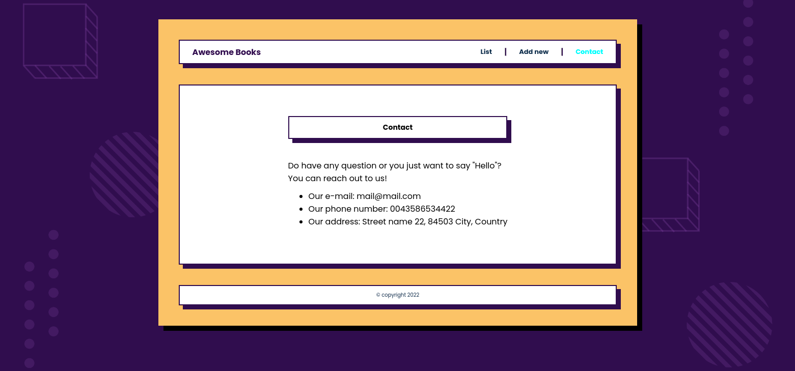

# books_with_es6

>	This is a repository for a book list app to store your favorite books.

## Screenshots:

## Built With

- HTML, CSS and JavaScript.

## Learning objectives

- Use ES6 modules to write modular JavaScript.
- Learn how to use proper ES6 syntax.
- Understand improvements that ES6 brings to JavaScript.
- Use npm as software packages system.

## Getting Started

- To get a local copy up and running follow these simple example steps:

### Prerequisites
  - "luxon": "^2.3.0",
  - "parcel": "^2.1.1",

### Setup

- Clone the repository with the command:

<code>
$ git clone https://github.com/andres-condezo/books_with_es6.git
</code>

- To install the dependencies run: 

<code>
$ npm Install
</code>

### Usage

- To create a development server built in run:

<code>
$ npx parcel index.html
</code>

- Now open http://localhost:1234/ in your browser to see the index.html file. 

## Authors

👤 **Andrés Condezo Monge**

- GitHub: [@andres-condezo](https://github.com/andres-condezo)
- Twitter: [@andres_condezo](https://twitter.com/andres_condezo)
- LinkedIn: [andres-condezo](https://linkedin.com/in/andres-condezo)

## Contributors

👤 **Hendrid**

- GitHub: [@hendridg](https://github.com/hendridg)
- Twitter: [@hendridg](https://twitter.com/hendridg)
- LinkedIn: [LinkedIn](https://linkedin.com/in/hendridg)

👤 **Lisandro**

- GitHub: [@lisandroseia](https://github.com/lisandroseia)
- LinkedIn: [LinkedIn](https://www.linkedin.com/in/lisandro-seia-295120225/)

## Show your support

Give a ⭐️ if you like this project!

## 📝 License

This project is [MIT](./MIT.md) licensed.
